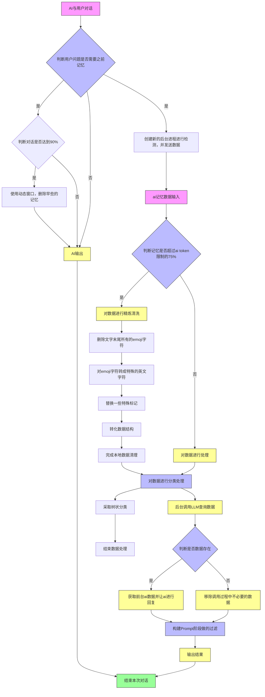

# LocalNexus
A privacy-first AI memory architecture for local deployment. Features a unique "Filter-First" pipeline: local noise removal ➡️ cloud refinement ➡️ file-isolated storage. Connects local data sovereignty with cloud intelligence seamlessly. Built with Python, LanceDB & OpenAI.

# 🧠 LocalNexus (本联智记)

> **Rooted Locally, Connected Intelligently.**  
> 根植本地，智联无限。

**LocalNexus** 是一个轻量级、隐私优先的 **AI 记忆管理架构**，专为本地部署设计，同时利用云端大模型的强大智能。

与传统记忆方案不同，LocalNexus 独创了 **"Filter-First" (先滤后云)** 处理流水线：
1. 🛡️ **本地去噪**：在数据离开本地前，通过规则引擎过滤无效信息，保护隐私并节省 Token。
2. ☁️ **云端精炼**：仅将精华数据发送至云端 LLM 进行分类、标签化和摘要。
3. 📂 **物理隔离**：采用 **每用户独立文件 (File-Isolated)** 存储策略，无需复杂数据库服务器。
4. ⚡ **异步整理**：后台非阻塞式记忆维护，确保主对话零延迟。

---

## ✨ 核心特性 (Key Features)

- **🔒 极致隐私 (Privacy First)**  
  原始对话数据永远留在本地。只有经过清洗和脱敏的“精华片段”才会被发送到云端。

- **🗑️ 智能去噪 (Smart Noise Filtering)**  
  内置可配置的本地规则引擎，自动剔除表情、寒暄、重复内容，大幅降低云端 API 成本。

- **🏷️ 动态分类与标签 (Dynamic Tagging)**  
  利用云端 LLM 自动为记忆片段生成结构化标签（如 `coding`, `planning`, `chat`），支持基于标签的精准检索过滤。

- **💾 文件级隔离存储 (File-Isolated Storage)**  
  基于 **LanceDB** 嵌入式引擎，每个用户对应一个独立的文件夹 (`./storage/user_id/`)。备份、迁移、删除用户数据只需操作文件系统。

- **⚡ 异步后台工人 (Async Background Worker)**  
  记忆整理、分类、存储过程在独立线程中异步运行，完全不阻塞用户的主对话流程。

- **🎯 意图驱动检索 (Intent-Driven Retrieval)**  
  内置轻量级意图路由器，仅在用户问题涉及历史记忆时触发检索，减少不必要的计算开销。

---

## 🏗️ 架构原理 (Architecture)

LocalNexus 采用 **混合云架构 (Hybrid Cloud Architecture)**，处理流程如下：

---

## 🔍 详细处理流程

### 1. 记忆需求判断
- 系统首先判断用户当前问题是否需要参考历史记忆
- 若需要，进一步判断对话上下文是否已达到90%的记忆容量阈值
- 如达到阈值，则使用动态窗口机制删除较早的记忆片段

### 2. 数据预处理
- **Token限制检查**: 判断记忆数据是否超过AI token限制的75%
- **数据清洗**: 
  - 删除文字末尾所有emoji字符
  - 将emoji字符转换为特殊英文字符
  - 替换特殊标记
  - 转换数据结构以适应后续处理

### 3. 分类与处理
- 采用树状分类方法对数据进行结构化分类
- 分类后的数据用于后续的LLM查询

### 4. 云端交互
- 后台调用LLM进行数据查询
- 根据查询结果决定是否需要获取前台AI数据并让AI进行回复
- 在Prompt构建阶段进行必要的过滤处理

### 5. 输出与反馈
- 最终输出处理结果
- 完成本次对话循环